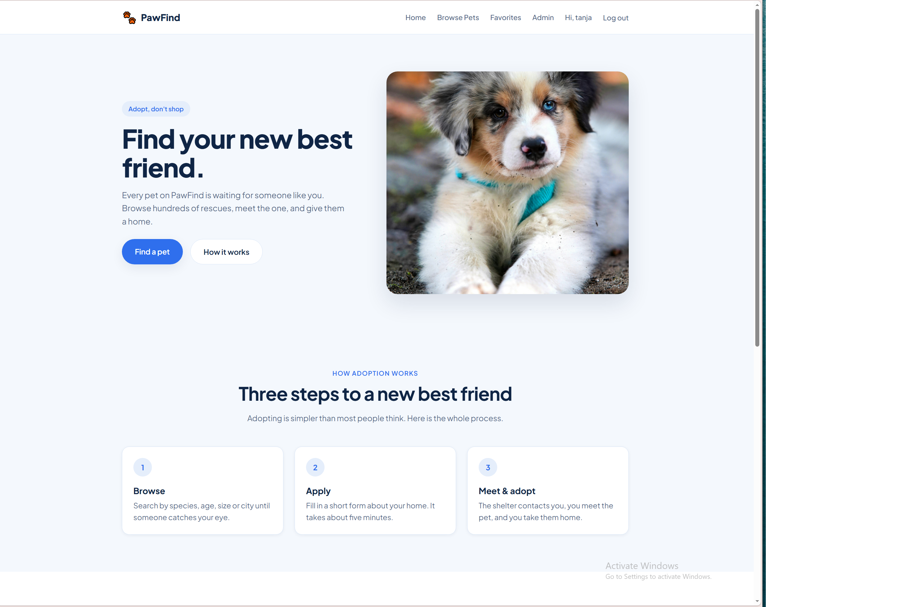
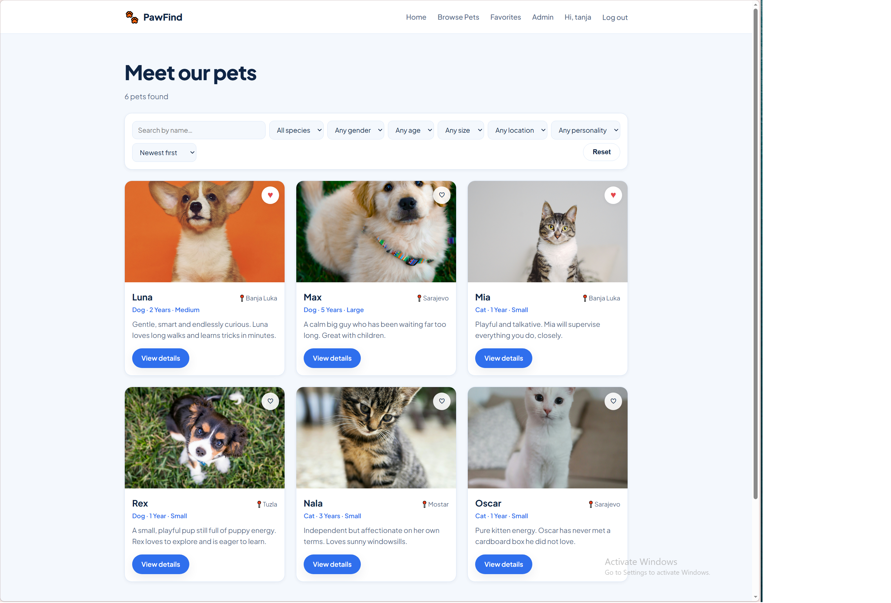
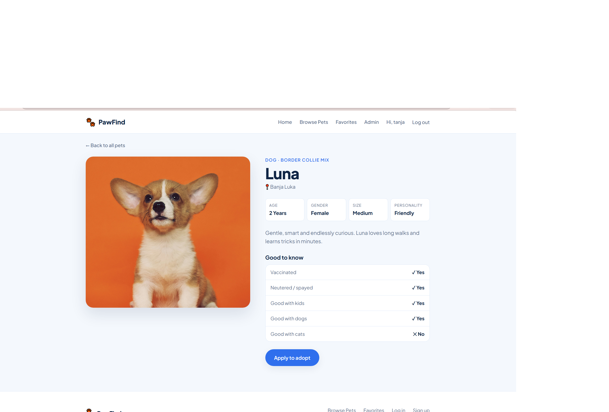

# 🐾 PawFind

**Find your new best friend.**

A full-stack pet adoption platform where visitors can browse rescue animals,
save favourites, and apply to adopt — and where shelter staff can manage pets
and adoption applications from an admin dashboard.

Built from scratch as my first full-stack project: no frontend framework,
no ORM, no starter template.

---

## Screenshots

| Home | Browse pets |
|---|---|
|  |  |

| Pet details |
|---|
|  |
---

## Tech stack

**Frontend** — HTML5, CSS3, vanilla JavaScript
No frameworks. Responsive layout with CSS Grid and Flexbox, design tokens as
CSS custom properties, and a mobile navigation built with plain DOM APIs.

**Backend** — Node.js, Express
REST API with modular routers, session-based authentication, and role-based
authorization middleware.

**Database** — MySQL 8
Six related tables with foreign keys, cascading deletes, and a many-to-many
junction table for favourites.

**Libraries** — `express`, `mysql2`, `express-session`, `bcryptjs`, `dotenv`, `multer`

---

## Features

### For visitors
- Browse available pets, with a photo carousel for pets with more than one picture
- Search by name, filter by species, gender, age group, size, location and personality
- Sort by name, age or date added
- View full pet details
- Apply to adopt, with or without an account
- Send a message from the Contact us page
- Switch the whole site between English and Serbian (Latin) — the choice is remembered per browser
- Browse pets that have already found a home

### For registered users
- Create an account with a hashed password
- Save favourite pets — stored in the database, not in the browser
- List a pet for adoption — goes live once an admin reviews and approves it
- Track adoption applications and their status
- Personal profile with statistics

### For administrators
- Dashboard with live statistics
- Full CRUD on pets: create, read, update, delete
- Review pets submitted by users and publish them
- View all applications, including guest applications
- Change application status — approving one automatically marks the pet as adopted
- Read and reply to Contact us messages
- Pick the home page hero photo from every photo ever uploaded for a pet, or upload a brand new one
- Curate "success story" spotlight cards on the home page — as many as you like, each with its
  own photo(s) and caption, shown as a carousel visitors can page through

---

## Getting started

### Prerequisites
- [Node.js](https://nodejs.org) 18 or newer
- [MySQL](https://dev.mysql.com/downloads/) 8 or newer

### 1. Clone and install

```bash
git clone https://github.com/tanjastankic2005-beep/pawfind.git
cd pawfind
npm install
```

### 2. Create the database

Open MySQL Workbench and run, in order:

```
backend/database/schema.sql
backend/database/seed.sql
```

The first creates the database and its nine tables.
The second fills the `pets` table with sample data.

Already have a database from before `pet_images`, `messages`,
`pets.description_sr`, `messages.reply`, `pets.adopted_at`/`adopted_by`, `settings`
or `success_stories`/`success_story_images` existed? Run the matching file(s) from
`backend/database/migrate-*.sql`, in order, instead — each adds just its own table
or column (`migrate-pet-images.sql` also copies each pet's existing `image` into
`pet_images`; `migrate-description-sr.sql` also backfills a Serbian description for
the six pets from `seed.sql`; `migrate-success-stories.sql` also folds any existing
success-story photos and caption into the new multi-story shape) without touching
the rest of your data.

### 3. Configure environment variables

Copy the example file and fill in your own values:

```bash
cp .env.example .env
```

```
DB_HOST=localhost
DB_USER=root
DB_PASSWORD=your_mysql_password
DB_NAME=pawfind
PORT=3000
SESSION_SECRET=any_long_random_string
```

### 4. Run

```bash
npm run dev     # development, restarts on file changes
npm start       # production
```

Open **http://localhost:3000**

### 5. Create an admin account

Register through the interface, then promote the account in MySQL:

```sql
UPDATE users SET role = 'admin' WHERE email = 'your@email.com';
```

Log out and back in — an **Admin** link appears in the navigation.

---

## API

| Method | Endpoint | Access | Description |
|---|---|---|---|
| `GET` | `/api/pets` | public | List available and adopted pets, with search, filters and sorting |
| `GET` | `/api/pets/adopted` | public | Pets who found a new home, most recent first |
| `GET` | `/api/pets/:id` | public | Single pet, with its photos |
| `POST` | `/api/pets` | admin | Create a pet |
| `POST` | `/api/pets/submit` | user | Submit a pet for adoption — goes live as `pending` until an admin approves it |
| `PUT` | `/api/pets/:id` | admin | Replace a pet |
| `DELETE` | `/api/pets/:id` | admin | Delete a pet |
| `POST` | `/api/auth/register` | public | Create an account |
| `POST` | `/api/auth/login` | public | Start a session |
| `POST` | `/api/auth/logout` | public | End the session |
| `GET` | `/api/auth/me` | public | Current user, or 401 |
| `GET` | `/api/favorites` | user | Saved pets, with full pet data |
| `GET` | `/api/favorites/ids` | user | Saved pet IDs only |
| `POST` | `/api/favorites` | user | Save a pet |
| `DELETE` | `/api/favorites/:petId` | user | Remove a saved pet |
| `POST` | `/api/applications` | public | Submit an adoption application |
| `GET` | `/api/applications/me` | user | My applications |
| `PATCH` | `/api/applications/:id/status` | admin | Change application status |
| `GET` | `/api/admin/stats` | admin | Dashboard statistics |
| `GET` | `/api/admin/pets` | admin | All pets, including pending and adopted |
| `GET` | `/api/admin/applications` | admin | All applications |
| `POST` | `/api/contact` | public | Send a message from the Contact us page |
| `GET` | `/api/admin/messages` | admin | All contact messages, unanswered ones first |
| `PATCH` | `/api/admin/messages/:id/reply` | admin | Save a reply and open it in the admin's email client |
| `DELETE` | `/api/admin/messages/:id` | admin | Delete a contact message |
| `GET` | `/api/settings` | public | Site settings (currently just the home page hero photo) |
| `GET` | `/api/admin/images` | admin | Every photo ever uploaded for a pet, most recent first |
| `PUT` | `/api/admin/settings/hero-image` | admin | Set the home page hero photo to an existing one |
| `POST` | `/api/admin/settings/hero-image/upload` | admin | Upload a brand new photo and use it as the hero photo |
| `GET` | `/api/success-stories` | public | All success stories with their photos, for the home page carousel |
| `GET` | `/api/admin/success-stories` | admin | All success stories with their photos, for the admin dashboard |
| `POST` | `/api/admin/success-stories` | admin | Add a new success story (caption only) |
| `PUT` | `/api/admin/success-stories/:id` | admin | Update a story's caption |
| `DELETE` | `/api/admin/success-stories/:id` | admin | Delete a story and its photos |
| `POST` | `/api/admin/success-stories/:id/images` | admin | Add an existing photo to a story |
| `POST` | `/api/admin/success-stories/:id/images/upload` | admin | Upload a brand new photo and add it to a story |
| `DELETE` | `/api/admin/success-stories/:storyId/images/:imageId` | admin | Remove a photo from a story |

**Query parameters on `/api/pets`:**
`search`, `species`, `gender`, `age`, `size`, `location`, `personality`, `sort`

**Status codes used:** `200` `201` `400` `401` `403` `404` `409` `500`

---

## Database

```
users                    pets                     pet_images
  id (PK)                  id (PK)                  id (PK)
  name                     name, species, breed,    pet_id (FK)
  email (UNIQUE)           age, gender, size,       image
  password (hashed)        location, description,   sort_order
  role                     description_sr,
  created_at               image (cover), personality,
                           vaccinated, neutered,
                           good_with_kids / dogs / cats
                           status, adopted_at, adopted_by,
                           created_at
      |                        |    |                  |
      |  1                   1 |    |  1              N |
      |                        |    +--------------------+
      +---- applications ------+
      |      user_id (FK, nullable - guests allowed)
      |      pet_id  (FK)
      |      housing details, reason, status
      |
      +---- favorites ---------+
             user_id (FK) + pet_id (FK)
             UNIQUE(user_id, pet_id)

messages (standalone — no foreign keys)
  id (PK), name, email, message, reply, replied_at, created_at

settings (standalone — key/value pairs, e.g. hero_image)
  setting_key (PK), setting_value

success_stories             success_story_images
  id (PK)                     id (PK)
  text, text_sr                story_id (FK)
  sort_order, created_at       image, sort_order, created_at
      |                              |
      |  1                         N |
      +------------------------------+
             UNIQUE(story_id, image)
```

`applications.user_id` is nullable so visitors can apply without an account.
`favorites` is a junction table implementing a many-to-many relationship.
`pet_images` holds every uploaded photo for a pet, ordered by `sort_order`; `pets.image` always
mirrors the first one and is kept as the cover photo shown in listings and cards.
`pets.description_sr` is an optional Serbian translation of `description`, filled in from the
admin form; visitors who switch the site to Serbian see it instead of the English description,
falling back to `description` when it is empty.
`pets.status` also accepts `pending`: pets submitted by regular users through `/api/pets/submit`
are created with this status, stay out of the public `/api/pets` listing, and only appear once
an admin edits them to `available` from the dashboard.
`messages` stores submissions from the Contact us page for admins to read, reply to and delete.
There is no email-sending service configured, so a reply is saved in `reply` / `replied_at` and
also opened as a pre-filled `mailto:` link, which sends through the admin's own email account.
When a pet's status becomes `adopted` (an admin edit, or approving an application) `adopted_at`
is set automatically and `adopted_by` records who adopted them; both are shown on the pet's page
and on the "pets who found a new home" listing.
`settings` is a generic key/value table; today it only holds `hero_image`, the home page hero photo.
`success_stories` powers the home page spotlight: each row is one adoption story (an English and
an optional Serbian caption) with its own photos in `success_story_images` — one photo shows a
single image, several show a mini slideshow with arrows and dots. With more than one story, the
whole section becomes a carousel visitors can page through; the section is hidden entirely
whenever there are no stories. Deleting a story cascades to its photo rows, but — like removing a
single photo from a story — never deletes the underlying file, since it may still be used
elsewhere (a pet's gallery, or the hero photo).
All foreign-keyed tables above use `ON DELETE CASCADE`.

---

## Project structure

```
pawfind/
├── backend/
│   ├── database/
│   │   ├── db.js            connection pool
│   │   ├── schema.sql       table definitions
│   │   └── seed.sql         sample data
│   ├── middleware/
│   │   ├── auth.js          requireAuth, requireAdmin
│   │   └── upload.js        shared multer config for photo uploads
│   ├── routes/
│   │   ├── pets.js
│   │   ├── auth.js
│   │   ├── applications.js
│   │   ├── favorites.js
│   │   ├── admin.js
│   │   ├── contact.js
│   │   ├── settings.js
│   │   └── success-stories.js
│   └── server.js            configuration and route mounting
│
├── frontend/
│   ├── css/style.css        design tokens and all styling
│   ├── images/
│   │   └── uploads/         photos uploaded through the app
│   ├── js/
│   │   ├── api.js           every call to the backend
│   │   ├── main.js          navigation, toast messages
│   │   ├── i18n.js          EN/SR dictionary, language switcher
│   │   └── ...              one file per page
│   └── *.html               eleven pages
│
├── docs/                    screenshots
├── .env.example
└── package.json
```

---

## Security

- Passwords hashed with **bcrypt** (cost factor 10, per-user salt)
- Sessions in **httpOnly cookies** — unreadable from JavaScript
- All SQL uses **prepared statements** — no string concatenation
- `ORDER BY` and status values validated against **whitelists**
- Input validated on **both** the client and the server
- Secrets kept in `.env`, excluded from version control
- Authorization enforced **server-side**; hidden UI is never the protection

---

## What I learned

This was my first backend and my first database. Along the way I worked through
what a server actually is, how HTTP requests and responses travel, how to design
a relational schema with primary and foreign keys, how to write SQL joins, how
sessions keep a stateless protocol stateful, why passwords are hashed rather
than encrypted, and why every rule enforced on the frontend has to be enforced
again on the backend.

The trickiest lesson was that middleware order in Express *is* logic — a 404
handler in the wrong place silently swallowed half the API.

---

## Author

**Tanja Stankić**
[github.com/tanjastankic2005-beep](https://github.com/tanjastankic2005-beep)

Built as an internship project, 2026.